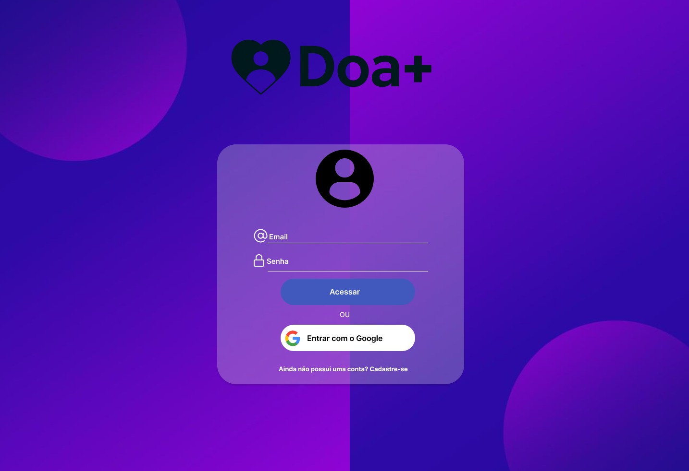
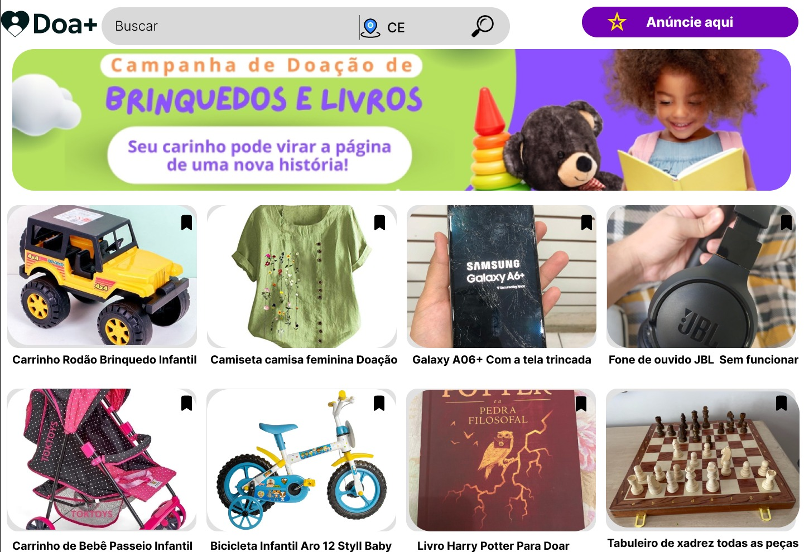
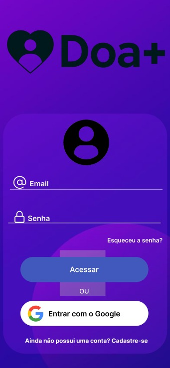
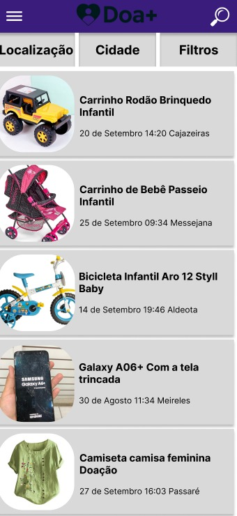

# Projeto DoaMais: Conectando Doadores e Donatários

## Descrição do Projeto 

O DoaMais é um sistema multiplataforma (web e móvel) projetado para conectar pessoas que desejam doar itens que não utilizam mais com aquelas que precisam desses itens.  A plataforma facilita a doação de objetos que, de outra forma, poderiam ser descartados indevidamente, promovendo a reutilização, a economia circular e a solidariedade na comunidade.


## Problema Abordado e Justificativa 

Diariamente, toneladas de itens em bom estado de conservação são descartados como lixo, aumentando o volume nos aterros sanitários e contribuindo para a degradação ambiental. Em Fortaleza, o descarte irregular é um problema crônico em diversos bairros.  Muitas vezes, o que é "lixo" para uma pessoa pode ser um recurso valioso para outra. A falta de um canal eficiente e acessível que conecte doadores e potenciais donatários impede que esses itens sejam reaproveitados. O ReAproveita surge para resolver essa lacuna, oferecendo uma solução tecnológica com impacto social e ambiental positivo. 


## Relação com o ODS 11: Cidades e Comunidades Sustentáveis 

O projeto está diretamente alinhado ao ODS 11, que visa tornar as cidades mais inclusivas, seguras, resilientes e sustentáveis.  O ReAproveita contribui para as metas do ODS 11 ao:


Reduzir o lixo urbano: Ao facilitar a reutilização de itens, o aplicativo ajuda a diminuir a quantidade de resíduos enviados para aterros, auxiliando na gestão ambiental urbana. 
Promover a economia circular: A plataforma incentiva um modelo de consumo mais sustentável, onde os produtos têm sua vida útil prolongada.
Fortalecer laços comunitários: Ao conectar vizinhos e moradores da mesma cidade, o sistema promove a solidariedade e a criação de comunidades mais resilientes.


**Objetivos do Sistema**

*Objetivo Geral:* Desenvolver uma plataforma digital para facilitar a doação e o reaproveitamento de itens diversos, reduzindo o descarte e promovendo a sustentabilidade.

*Objetivos Específicos*:

* Permitir que usuários cadastrem itens para doação de forma rápida e intuitiva.
* Facilitar a busca e a localização de itens disponíveis para doação por categoria e proximidade.
* Oferecer um canal de comunicação seguro entre doador e interessado.
* Promover a confiança entre os usuários por meio de um sistema de avaliação mútua.


**Escopo do Projeto**

**Incluso:**

* Cadastro e autenticação de usuários (doadores e donatários).
* Publicação de itens para doação com descrição, fotos e categoria.
* Busca de itens por filtros (categoria, palavra-chave, localização).
* Sistema de "match" ou manifestação de interesse em um item.
* Chat para combinar a retirada do item.
* Sistema de avaliação e reputação dos usuários.

**Não Incluso (nesta fase):**

* Logística de entrega ou frete.
* Transações financeiras ou trocas.
* Doações para ONGs ou instituições (foco em pessoa-pessoa).
* Gamificação ou sistema de pontos.


## Visão Geral da Arquitetura (com diagrama) 


A arquitetura do sistema será baseada em um modelo cliente-servidor. As aplicações cliente (Web e Mobile) se comunicarão com um serviço de backend através de uma API REST. O backend será responsável pelas regras de negócio e pela comunicação com o banco de dados.

``` inicio diagrama
+----------------+      +-----------------+      +-----------------------+
|                |      |                 |      |                       |
|   Cliente Web  |      |  Cliente Mobile |      |     Serviços de       |
|    (React)     |      | (React Native)  |      |     Terceiros         |
|                |      |                 |      |  (Mapas, Notificações)|
+-------+--------+      +--------+--------+      +-----------+-----------+
        |                        |                          |
        |                        |                          |
        +-----------+------------+--------------------------+
                    |
                    | HTTPS (Requisições)
                    v
+-------------------------------------------------------------------------+
|                                                                         |
|                         Backend (Servidor Node.js)                      |
|                                                                         |
|    +----------------------+      +----------------------+               |
|    |      API REST        |----->|   Lógica de Negócio  |               |
|    | (Express.js)         |      | (Autenticação, etc.) |               |
|    +----------------------+      +----------+-----------+               |
|                                             |                           |
|                                             |                           |
|                                             v                           |
|                                  +--------------------+                 |
|                                  |   Banco de Dados   |                 |
|                                  |    (PostgreSQL)    |                 |
|                                  +--------------------+                 |
|                                                                         |
+-------------------------------------------------------------------------+
```


## Tecnologias Propostas 


* Frontend Web: React.js
* Frontend Mobile: React Native
* Backend: Node.js com Express.js
* Banco de Dados: PostgreSQL
* Prototipação: Figma 
* Documentação da API: Swagger 
* Controle de Versão: Git e GitHub


## Integrantes da Equipe e Seus Papéis


* Moacir Cadmiel Silva dos Santos (Matrícula: 2318038): Gerente de Projeto e Arquiteta de Software.

* Rangel Amaral Ferreira (Matrícula: 2327067): Desenvolvedor Backend e DBA.

* Clarissa da Silva Freitas (Matrícula: 2315233): Desenvolvedora Frontend (Web e Mobile).

* João Pedro Pereira Alves (Matrícula: 2326205): Especialista em UX/UI e Prototipação.

* Paulo Ricardo de Castro Sousa (Matrícula: 2326189): Analista de QA e Requisitos.


## Cronograma para Etapa 2 (N708)
```
+-----------------------------------------------------------------------------------------------+
Semana | Atividade                                     |  Responsáveis                           |
+-----------------------------------------------------------------------------------------------+
1-2    | Configuração do ambiente e Sprint 0           |  Todos                                  |
3-4    | Sprint 1: Autenticação e Perfil de Usuário    |  Rangel (Back), Clarissa (Front)        |
5-6    | Sprint 2: Cadastro e Visualização de Itens    |  Rangel (Back), Clarissa (Front)        |
7-8    | Sprint 3: Busca, Filtros e Chat em tempo real |  Cadmiel (Back), João Pedro (Front)     |
9-10   | Sprint 4: Sistema de Avaliação e Notificações |  Paulo Ricardo (Back), Clarissa (Front) |
11     | Testes de integração e usabilidade            |  João Pedro, Paulo Ricardo              |
12     | Refatoração, ajustes e preparação para deploy |  Todos                                  |
13     | Deploy e Documentação Final                   |  Cadmiel                                |  
+-----------------------------------------------------------------------------------------------+
```


### Protótipos de Interface

#### Versão Web



#### Versão Mobile


